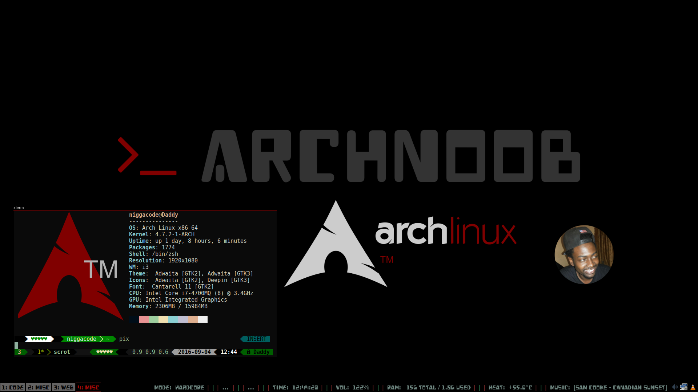
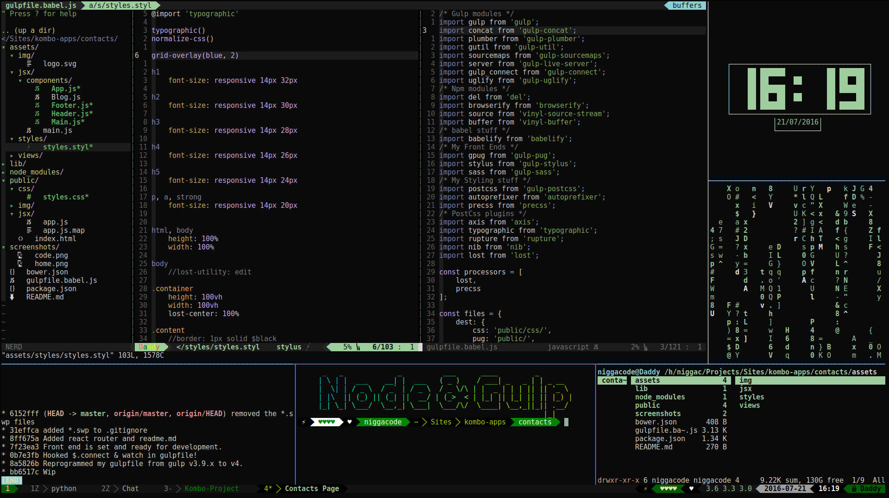
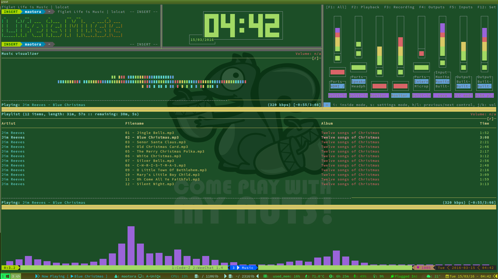
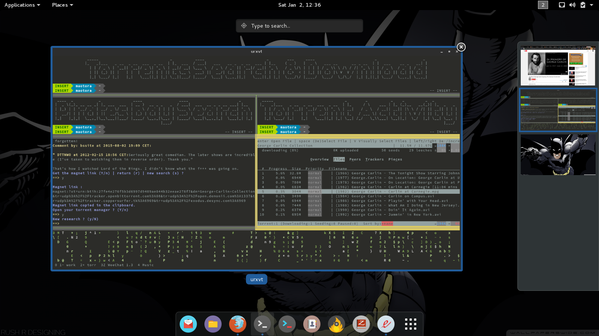
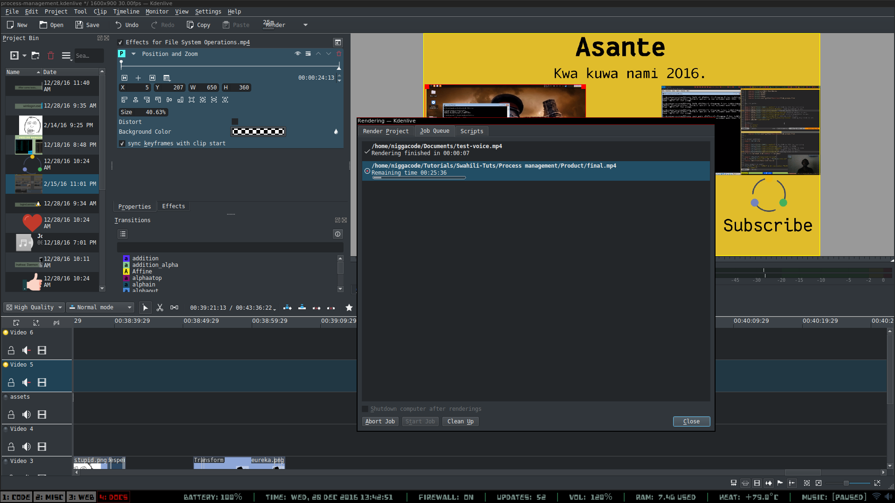
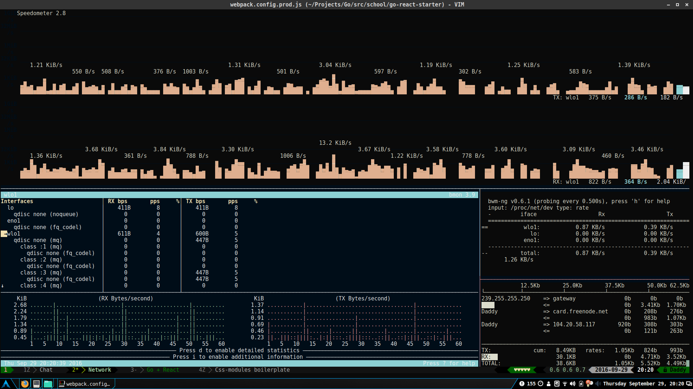

# My Dotfiles

## The Setup

### Window Manager

    i3wm –> <3 Window Manager
    i3-blocks –> <3 i3 status menu bar
    conky –> Yeah, my ex status panes / menu stuffs
    nitrogen –> Background Images manager
    xclip –> Clipboard!

### Coding Environment

    tmux –> Terminal Manager
    vim-nox –> <3 Cutest Text Editor
    ranger –> Terminal File manager
    powerline –> Cute bars on Terminal and Vim

### Useful Vim Plugins

    vim-pathogen –> Plugin Manager Yeah, I haven't evolved yet (U can check on vim-vundle)
    vim-airline –> Lighter powerline bars for vim
    vim-airline-themes –> Yeah, you need this to change themes on those bars
    vim-devicons –> Places some cute icons on vim bars & NerdTree
    vim-webdevicons –> Yeah, I do Icons a lot
    toboo.vim –> I can name my Tabs with this cute plugin
    vim-nerdtree –> Yeah, It's a file structure view (Pretty cool)
    vim-vinegar –> kinda like nerdtree but it's simpler!
    vim-surround –> Creates, Changes & deletes surrounded text with tags/quotes
    vim-gruvbox –> Light & Dark theme
    vim-watchforchanges –> It updates vim's buffers when receiving an update
    vim-autoread –> Not sure if I'm using this or the above one
    vim-commentary –> Tries to comment text according to filetype
    vim-colortoggle –> changes colors for multi-colored themes
    vim-notes –> <3 lets you write notes in a semi markdown syntax
    vim-zoomWin –> Lets you vertically zoom your windows, tab independent
    vim-fzf –> Fuzzy finder plugin for vim, it's pretty neat
    vim-loremipsum –> Gives that placeholder text

There is lots of vim-syntax'ed plugins, I'm won't post them here you can just
do vim-jsx or vim-node or vim-rb, vim-py and get the particular syntax plugin
yoo looking for.

### Music & Videos

    mpd –> <3 Music Server
    ncmpcpp –> <3 Curses Music player (mpd client)
    mpc –> <3 Terminal mpd client
    pacmixer –> Pulseaudio Curses Mixer
    youtube-dl –> Terminal youtube downloder
    cmus –> Terminal Music player
    pianobar –> Pandora.com music player
    cava –> Gives Nice Music Visualizers with custom colors

### Cli Browsers

    mutt –> Terminal Email Reader
    w3m –> Terminal Browser with Images!
    elinks –> Advanced Terminal Browser That I usually don't use
    lynx –> Yeah, I just added this here to look cool

### Useful Tools in IRC

    weechat –> <3 Terminal IRC client
    bitlbee –> <3 facebook, twitter, gitter & discord protocol for weechat
    urlview –> <3 sends urls sent from IRC to desired $BROWSER
    pastebinit –> Yeah, I'm way past this (using ptpb now) But hey, it pastes stuff

### Torrenting

    transmission-cli –> Bittorrent client
    transmission-remote-cli –> Console client for Transmission bittorrent above
    torrtux –> <3 Searches thepiratesbay for a torrent in the terminal, ncurse based!

### Videos Production
    
    openshoot –> Yeah, it crashes a lot, not sure why I placed it first
    kdenlive –> Beautiful, less complicated video editor I use
    handbrake –> I use this for video compressing, but it can be advanced
    ffmpeg –> Yeah, I only use this to increase my audio volume, but a dependency in other apps
    inkscape –> Use it for Vector Images and most of my banners
    Audacity –> Use it for my Audio Editing, it's simple

### News

    newsbeuter –> Terminal news thing that I almost never use
    IRC freenode/##news –> The closest I come to reading news

### System Management

    rsync –> Backup
    samba –> Windows Clients Management
    mongodb –> Schemaless logs
    mysql –> Planned logs
    htop –> Process Monitoring
    bmon –> Network Monitoring

### References

* [Archlinux](https://archlinux.org) The Linux Distribution I'm using
* [Archwiki](https://wiki.archlinux.org/index.php) For detailed documentation on most software used
* [AUR](https://aur.archlinux.org/index.php) For some software mentioned in this repo
* [Gotbletu](https://github.com/gotbletu/dotfiles) For some scripts used in this repo and more

Alright Peace!
